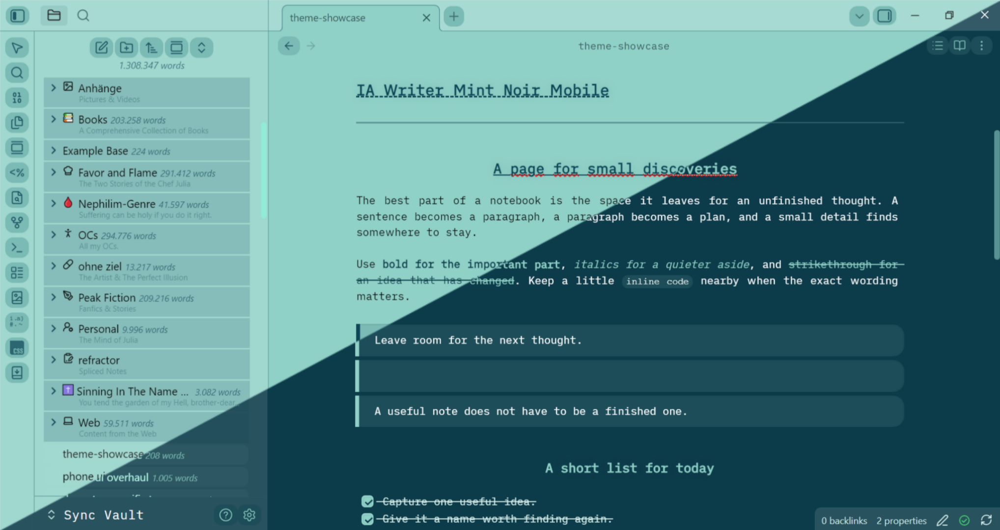
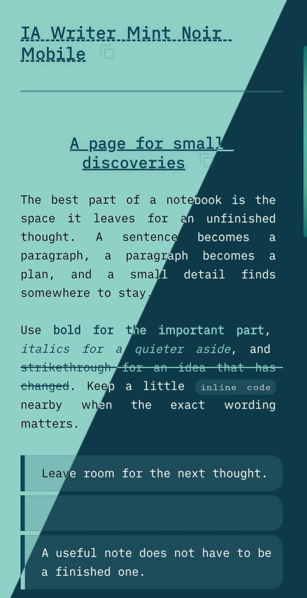

# IA Writer Mint Noir Mobile

### Click [here](https://github.com/julez122/IA-Writer-Mint-Noir-Mobile/blob/37c32f0b26b547a9de9309f0b787398f2b6a6d61/snippets/dark.css) for the dark theme snippet.
### If you see this on GitHub, [download the theme here!](https://community.obsidian.md/themes/ia-writer-mint-noir-mobile)





*Soft mint pages, deep teal details, and iA Writer Duospace.*

**Mobile first · Light and dark · Version 1.0.0 · By Julia**

## Overview

**Mint Noir** is a custom theme for [Obsidian](https://obsidian.md), created for writing, reading, and organizing notes on a phone. Its light palette pairs a mint background with black text and deep teal accents. Dark mode brings deep blue-green surfaces, white text, and brighter mint details.

The design carries through notes, file navigation, Properties, Bases, and mobile controls. Compact typography, rounded surfaces, folder shading, and subtle gradients give the workspace a consistent appearance.

Mint Noir is a finished personal project. No further design changes are currently planned. You can install it manually by downloading the files in the Releases page or directly download it download it [here](https://community.obsidian.md/themes/ia-writer-mint-noir-mobile) in Obsidian's community theme directory.

> **Two files for the theme, one snippet for dark mode.** Install `theme.css` and `manifest.json` as the theme. Install `snippets/dark.css` separately as a CSS snippet if you want dark mode or automatic light/dark switching.

## Table of Contents

- [Overview](#overview)
- [Installation](#installation)
- [Features](#features)
- [Markdown Showcase](#markdown-showcase)
- [Requirements](#requirements)
- [Usage](#usage)
- [Customization](#customization)
- [Troubleshooting](#troubleshooting)
- [Project Files](#project-files)
- [Project Status and Feedback](#project-status-and-feedback)
- [Credits](#credits)
- [License](#license)

## Installation

### 1. Get the files

Download or copy [theme.css](theme.css) and [manifest.json](manifest.json). For dark mode, also get [dark.css](snippets/dark.css). On GitHub, download the raw files or download and extract the repository ZIP; do not save the HTML file-preview page as a stylesheet.

### 2. Install the theme

Inside your vault's configuration folder, create `themes/IA Writer Mint Noir Mobile/`. Place **both** `theme.css` and `manifest.json` directly inside that folder.

The folder name must match the name in the manifest: **IA Writer Mint Noir Mobile**. This follows Obsidian's [theme installation structure](https://github.com/obsidianmd/obsidian-developer-docs/blob/main/en/Themes/App%20themes/Build%20a%20theme.md).

### 3. Install the dark-mode snippet

Create a `snippets` folder inside the configuration folder if it does not already exist, then place `dark.css` inside it. The complete setup looks like this:

```text
Your vault/
└── .obsidian/
    ├── themes/
    │   └── IA Writer Mint Noir Mobile/
    │       ├── manifest.json
    │       └── theme.css
    └── snippets/
        └── dark.css
```

`dark.css` belongs in `snippets`, not in the theme folder. It is a companion to Mint Noir, not a standalone theme. You can skip it if you will only use the light color scheme.

### 4. Enable everything in Obsidian

1. Open **Settings → Appearance**.
2. Select **IA Writer Mint Noir Mobile** from the theme dropdown. Restart Obsidian if the newly installed theme does not appear.
3. For dark mode, scroll to **CSS snippets**, select **Reload snippets**, and enable **dark** (the file is `dark.css`). See Obsidian's [CSS snippet instructions](https://help.obsidian.md/snippets).
4. Set **Base color scheme** to **Light**, **Dark**, or **Adapt to system**.

### Installing on a phone or tablet

Use a file manager that can access the vault's configuration folder. Enable hidden-file visibility if `.obsidian` is not shown. If your mobile file manager cannot access that folder, place the files using a computer and sync the theme and snippet folders to the mobile vault.

Make sure your sync setup includes those configuration files, then check the selected theme and snippet toggle on the mobile device. Obsidian documents file-manager and sync approaches in its [mobile snippet guide](https://help.obsidian.md/snippets).

## Features

### Writing and reading

- **Embedded iA Writer Duospace:** bundled directly into the stylesheet for mobile use, with no separate font installation or remote font request.
- **Light and dark palettes:** mint and deep teal in light mode; dark blue-green and mint in dark mode through the companion snippet.
- **Distinct heading levels:** teal headings, a dashed underline for level one, an underlined and centered level two, and centered lower levels.
- **Compact document typography:** justified paragraphs, mobile spacing, and accent colors for bold, italic, and strikethrough text.
- **Styled links and footnotes:** teal links in light mode, brighter links in dark mode, and a custom `⤴` indicator for rendered external links.
- **Rounded blockquotes and code blocks:** tinted backgrounds, accent borders, and matching code-copy buttons. Code retains a monospace font.
- **Task lists:** custom rounded checkboxes in Reading view and Live Preview.
- **Markdown tables:** rounded corners, shaded headers, alternating rows, and styling for both Reading view and Live Preview.

### Navigation and mobile interface

- **Folder depth styling:** shaded file rows, gradient-backed nested folders, and visible indentation guides.
- **Mobile controls:** coordinated ribbon icons, menus, toggles, workspace drawers, and command palette typography.
- **Properties:** a rounded container with coordinated labels, values, and row backgrounds.
- **Gradient details:** a mint-to-teal empty-tab background and slim gradient scrollbars on supported mobile renderers.
- **Mobile table editing:** targeted styling to keep active row and column handles visible outside the table border while retaining the native table-scrolling container.

### Bases and optional plugins

The theme includes styling for **Bases table and card views**, including alternating table rows, compact tags and property text, and gradient card-cover backgrounds.

Additional CSS targets Extended Pandoc Markdown superscripts and subscripts, Novel Word Count labels, Copy Section buttons, and CSS editor command palette entries. These are optional styling additions; the theme does not install or require those community plugins.

## Markdown Showcase

1. Download [the showcase](docs/theme-showcase.md) and open it in your vault with the theme enabled.
2. Enable Mint Noir for the rendered typography, quote, tasks, table, code, and callout.
3. View the showcase in light and dark mode, keeping the dark snippet enabled.
4. Switch to **Live Preview** for an editing screenshot, or open the file drawer to show nested folders alongside the note.

## Requirements

- **Obsidian:** `manifest.json` declares a minimum app version of **1.5.0**. This is the manifest requirement, not a verified compatibility range for every styled feature.
- **A current app and rendering engine:** the CSS uses modern features such as `color-mix()` and `:has()`. Keep Obsidian and your device's system software current; on Android, also keep Android System WebView current.
- **Access to the vault's configuration folder:** needed to install the theme and optional snippet. The paths below assume the default `.obsidian` folder; substitute your configured folder name if it differs.
- **Dark mode:** requires the supplied `dark.css` snippet to be installed and enabled alongside the theme.
- **Bases styling:** requires an Obsidian version that includes Bases and the Bases core plugin enabled. Bases is optional for normal notes.

Mobile is the design priority. Desktop selectors are included, but the project does not provide a device-by-device or operating-system compatibility matrix. There is no build step, package manager, required community plugin, or Style Settings configuration panel.

## Usage

### Choose a color scheme

Keep Mint Noir selected under **Settings → Appearance**, then choose the desired **Base color scheme**:

- **Light:** the mint light palette from `theme.css`.
- **Dark:** the dark palette with `dark.css` enabled.
- **Adapt to system:** follows the device's light/dark setting, including a device-managed schedule, with `dark.css` enabled.

You can leave the dark snippet enabled while using Mint Noir in either mode. Its dark palette is activated by Obsidian's dark-mode class. The system-following behavior comes from Obsidian's [appearance settings](https://help.obsidian.md/appearance).

### Write and organize normally

Use ordinary Markdown in **Reading view**, **Live Preview**, or **Source mode**. The theme includes editor and rendered-note styles; some elements naturally look different while their Markdown is being edited.

The embedded font is applied automatically to note text and selected interface elements. Code uses Obsidian's monospace font. Properties and supported Bases views pick up their styles when you use those built-in features.

### Update or remove the theme

To update a manual installation, replace `theme.css` and `manifest.json` in the theme folder and replace `dark.css` in the snippets folder if you use it. Keep copies of any personal edits before replacing files, then restart Obsidian and check the snippet toggle.

To stop using Mint Noir, select another theme and **disable the dark snippet**. If desired, remove only the `IA Writer Mint Noir Mobile` theme folder and its `dark.css` snippet. Your notes and attachments remain in the vault.

## Customization

Mint Noir is a fixed personal design. It has no settings panel, and some font sizes and colors deliberately override Obsidian's appearance preferences.

## Troubleshooting

### The theme does not appear

Check that the folder name is exactly `IA Writer Mint Noir Mobile` and that `theme.css` and `manifest.json` are directly inside it. Avoid an extra nested folder from a downloaded ZIP, confirm the files are not saved with `.txt` extensions, and restart Obsidian.

### Dark mode looks incomplete or stays light

Confirm that `dark.css` is in the vault's `snippets` folder, reload the snippet list, and enable it. Then select **Dark**, or use **Adapt to system** while the device is in dark mode. Selecting a dark color scheme alone does not install the companion snippet.

### The appearance differs from the intended design

Temporarily disable other appearance snippets to check for conflicting styles, keeping `dark.css` enabled if testing dark mode. Check the app version and whether you are viewing the note in Reading view or an editing mode. Other plugins can also style the same interface elements.

### The font is missing or changing the text font has no effect

The theme intentionally applies its embedded font to note text with strong CSS overrides. If the font is missing, replace `theme.css` with an intact copy; a truncated base64 block cannot load the font. Changing Obsidian's text-font preference alone may not override the theme.

### Another theme still has Mint Noir colors

Disable the `dark.css` snippet when switching away from Mint Noir. Snippets remain enabled independently of the selected theme.

## Project Files

- [theme.css](theme.css) — main theme, embedded font, light palette, shared interface styling, and mobile adjustments.
- [dark.css](snippets/dark.css) — companion dark-mode snippet, installed separately.
- [manifest.json](manifest.json) — theme name, version, minimum app version, and author metadata.
- [theme-showcase.md](docs/theme-showcase.md)  — a ready-to-view theme showcase of the theme you can download to your vault.
- [README.md](README.md) — installation guide, feature reference, and Markdown screenshot sample.

## Project Status and Feedback

**Version 1.0.0** is the current version. The design is considered complete, and there is no planned feature roadmap.

Useful bug reports should include the Obsidian version, device and operating system, color scheme, editing or reading mode, enabled appearance snippets, and a screenshot or short reproduction. Mobile behavior and preservation of the existing folder and table styling are priorities for any proposed changes.

## Credits

- **Theme design and CSS:** Julia.
- **Application:** [Obsidian](https://obsidian.md).
- **Embedded typeface:** iA Writer Duospace by iA. See iA's [font project](https://github.com/iaolo/iA-Fonts) for upstream font information and attribution.

Mint Noir is an independent personal theme and is not an official Obsidian or iA product.

## License

[GNU General Public License v3.0](LICENSE)
